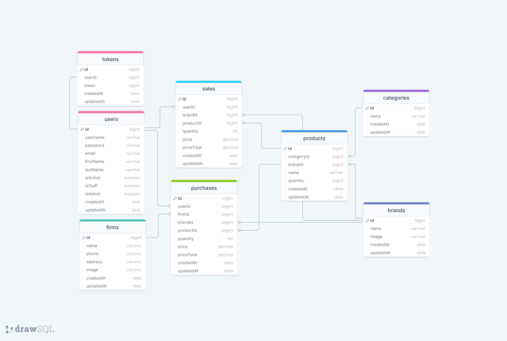

<h1 align="center" style="font-weight: bold;">MERN-01 Project(STOCK MANAGEMENT)     
    
    
    
 </h1>

<p align="center">
 <a href="#tech">Technologies</a> • 
 <a href="#started">Getting Started</a> • 
  <a href="#colab">Collaborators</a> •
 <a href="#contribute">Contribute</a>
</p>

<p align="center">
    <h2 id="description">Description</h2>

This project is a stock management system developed using the MERN (MongoDB, Express.js, React, and Node.js) stack. The goal is to allow users to add and update products and easily track their stock status.

The project consists of the following main components:

-MongoDB: Used as the database management system. All product and stock information is stored in MongoDB.<br>
-Express.js: A minimal web framework for Node.js used to manage server-side code and define API endpoints.<br>
-React: Used to create the user interface, providing dynamic and interactive user experiences.<br>
-Node.js: Used to run JavaScript on the server side, forming the backend of the application.

 <h2 id="technologies">💻Features </h2>

- Product Addition and Update: Users can add new products and update existing product information.
- Stock Tracking: Users can track the stock status of products.
- Stock Alerts: Users can receive alerts for products that fall below a certain stock level.
- Mobile Compatibility: The user interface is mobile-friendly, created using React and MUI, TailwindCSS.
- User Management: Users can register and log in to the system
- Populate:Mongoose method used to replace a path in a document with actual documents from other collections. It's commonly used to reference related documents.

 


<h2 id="layout">🎨 Layout</h2>

### ERD:



--- 

<h2 id="technologies">💻 Technologies</h2>

- Mongoose: An ODM (Object Data Modeling) library used to interact with MongoDB.
- Axios: A library used to manage HTTP requests.
- Redux: A library used for managing application state, utilized with Redux Toolkit.
- React Router: Used for navigation between pages in the application.
- dotenv: Used to manage environmental variables.


<h2 id="started">🚀 Getting started</h2>

Here you describe how to run your project locally


<h3>Cloning</h3>

How to clone your project

```bash
git clone https://github.com/mesbol6647/MERN-01-StokApp-.git)
```

<h3>Starting</h3>

How to start your project

```bash
cd project-name
npm some-command-to-run
```

<h2 id="colab">🤝 Collaborators</h2>

Special thank you for all people that contributed for this project.

<table>
  <tr>
    <td align="center">
      <a href="#">
        <br>
        <sub>
          <b>Mesut Bolat</b>
        </sub>
      </a>
    </td>     
  </tr>
</table>

<h2 id="contribute">📫 Contribute</h2>

Here you will explain how other developers can contribute to your project. For example, explaining how can create their branches, which patterns to follow and how to open an pull request

1. `git clone https://github.com/mesbol6647/MERN-01-StokApp-.git`
2. `git checkout -b feature/NAME`
3. Follow commit patterns
4. Open a Pull Request explaining the problem solved or feature made, if exists, append screenshot of visual modifications and wait for the review!

<h3>Documentations that might help</h3>

[📝 How to create a Pull Request](https://www.atlassian.com/br/git/tutorials/making-a-pull-request)

[💾 Commit pattern](https://gist.github.com/joshbuchea/6f47e86d2510bce28f8e7f42ae84c716)

### Folder/File Structure:
